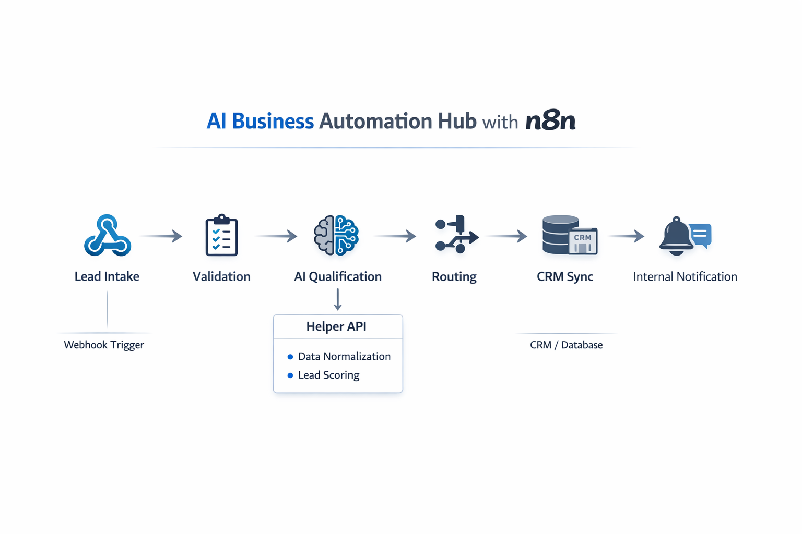

# AI Business Automation Hub with n8n


AI-powered business automation portfolio project built with n8n and a lightweight helper API to demonstrate lead intake, qualification, routing, CRM preparation, and internal notifications.

## Overview

This repository presents a modular automation architecture for business lead operations. It includes three n8n workflows, sample payloads, and a minimal FastAPI helper service to support reusable normalization and scoring logic.

## Why This Project Matters

Business teams often lose time on manual lead triage, inconsistent CRM updates, and delayed internal follow-up. This project shows a practical automation pattern that converts inbound lead data into structured, prioritized, CRM-ready outcomes with clear internal handoff signals.

## Implemented Workflows

Lead Intake Workflow (`workflows/lead-intake-workflow.json`)
- Webhook trigger accepts `POST /lead-intake` submissions
- Validates required fields and routes invalid payloads to an error response
- Normalizes core lead data and simulates AI-style qualification
- Prepares storage-ready output and internal notification content

AI Qualification & Routing Workflow (`workflows/ai-qualification-routing-workflow.json`)
- Webhook trigger accepts `POST /ai-qualification` structured lead payloads
- Prepares compact AI input context and simulates qualification output
- Routes leads by priority (high, medium, low)
- Builds CRM-ready fields and follow-up recommendations

CRM Sync & Notifications Workflow (`workflows/crm-sync-notifications-workflow.json`)
- Webhook trigger accepts `POST /crm-sync` qualified lead payloads
- Validates CRM-required fields with a clear error branch
- Builds normalized CRM sync record and lightweight audit log
- Formats internal alert messages and returns structured success output

These workflows are simulation-based portfolio examples intended to demonstrate architecture and logic patterns, not production vendor integrations.

## Example Business Use Cases

- B2B service firms automating lead triage from website forms
- Agencies prioritizing inbound opportunities before sales handoff
- Ops teams standardizing CRM preparation across different lead sources
- Internal teams requiring consistent alerting for high-priority leads

## Helper API

The helper API (`services/helper-api/`) is a lightweight FastAPI service designed for reusable workflow support logic.

Endpoints:
- `GET /health` returns service health (`{"status": "ok"}`)
- `POST /normalize-lead` returns cleaned and normalized lead fields
- `POST /score-lead` returns simulated qualification output (`lead_score`, `priority`, `lead_category`, `summary`)

## Getting Started

1. Clone the repository and move into the project folder.
2. Copy environment placeholders:

```bash
cp .env.example .env
```

3. Start local stack with Docker Compose:

```bash
docker compose up --build
```

4. Open local services:
- n8n: `http://localhost:5678`
- Helper API: `http://localhost:8000`
- Demo walkthrough: `docs/demo-walkthrough.md`

## Local Development

Docker Compose quick start:

```bash
docker compose up --build
```

Run helper API directly:

```bash
cd services/helper-api
python3 -m venv .venv
source .venv/bin/activate
pip install -r requirements.txt
uvicorn app:app --host 0.0.0.0 --port 8000 --reload
```

Additional references:
- Demo walkthrough: `docs/demo-walkthrough.md`
- Project summary: `docs/project-summary.md`
- Architecture notes: `docs/architecture.md`

## Folder Structure

```text
.
├── .env.example
├── docker-compose.yml
├── docs/
│   ├── architecture.md
│   ├── demo-walkthrough.md
│   └── project-summary.md
├── samples/
│   ├── sample-ai-output.json
│   ├── sample-crm-sync-output.json
│   ├── sample-lead.json
│   ├── sample-notification-message.json
│   └── sample-qualified-lead.json
├── services/
│   └── helper-api/
│       ├── README.md
│       ├── app.py
│       ├── requirements.txt
│       └── .gitkeep
└── workflows/
    ├── .gitkeep
    ├── ai-qualification-routing-workflow.json
    ├── crm-sync-notifications-workflow.json
    └── lead-intake-workflow.json
```

## Portfolio Highlights

- Modular n8n workflow design with clear phase separation
- Webhook-based intake and routing patterns for automation systems
- AI-style scoring and qualification simulation without vendor lock-in
- CRM-ready payload preparation and lightweight audit logging
- Internal notification automation for operational follow-up
- Repository structure and samples tailored for portfolio review

## Future Improvements

- Add additional workflow variants for multichannel lead sources
- Add payload schema validation examples for stronger contracts
- Add test harnesses for sample payload execution
- Add deployment notes for self-hosted and cloud n8n environments

## License

This project is licensed under the MIT License. See [LICENSE](LICENSE).
